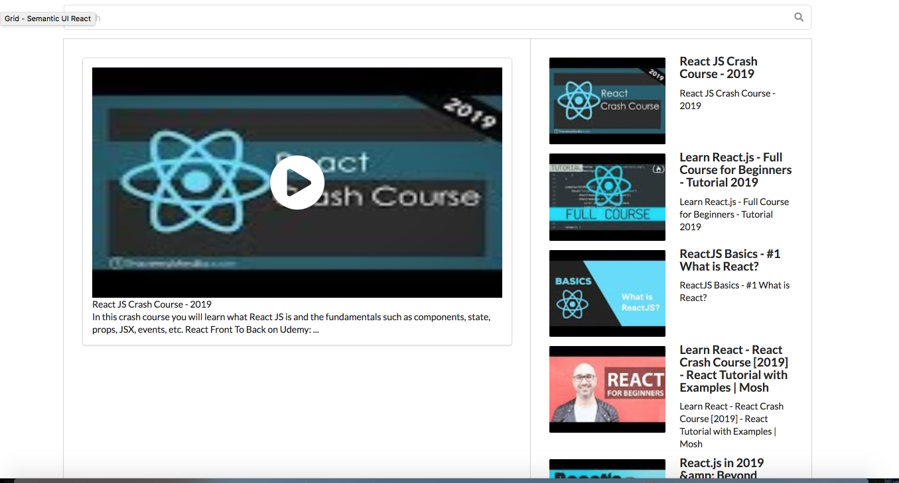

# About 

this repository is the source code for the EvidNet Front-end Job first assignment.

# Screen Shot

#  Used Tech Stack
- react, react-hooks(useState, useEffect) (CRA)
- youtube-api-v3-search
- Semantic UI, semantic-ui-react
